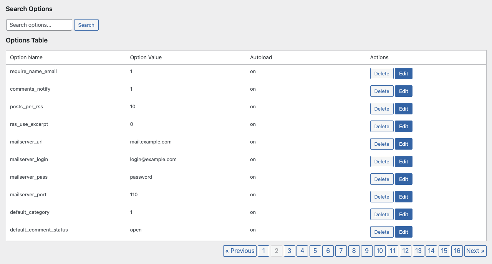
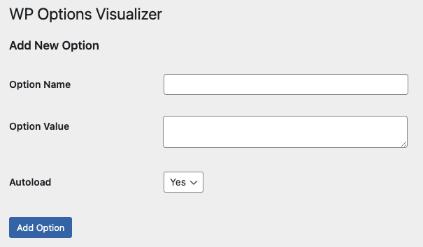
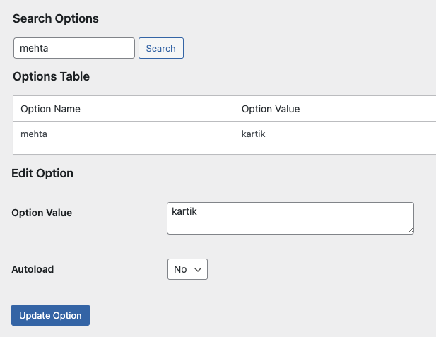

# See Your Options - Visualizer

**Contributors:** kartikmehta
**Tags:** options, database, visualizer, admin  
**Requires at least:** 6.0  
**Tested up to:** 6.7  
**Requires PHP:** 8.1.29  
**Stable tag:** 1.0.0  
**License:** GPL v2 or later  
**License URI:** https://www.gnu.org/licenses/gpl-2.0.html  

A plugin to visualize, add, edit, and delete options from the WordPress `wp-options` table via a user-friendly admin interface.

---

## Description

The **See Your Options - Visualizer** plugin allows you to manage options stored in the `wp-options` table directly from your WordPress admin panel. This plugin is perfect for developers and advanced users who need better visibility into their WordPress options or want an easier way to manipulate these options.

### Features

- **Visualize Options:** View options stored in the WordPress database with pagination and search functionality.  
- **Add New Options:** Add new options with a name, value, and autoload status.  
- **Edit Existing Options:** Modify the value or autoload status of existing options.  
- **Delete Options:** Remove unused or unnecessary options safely.  
- **Search:** Quickly find options by their name using a search field.  

This plugin adheres to WordPress security best practices, including sanitization and nonce verification for all operations.

---

## Installation

### From the WordPress Dashboard:

1. Navigate to the Plugins > Add New page.
2. Search for `See Your Options - Visualizer`.
3. Click "Install Now."
4. Activate the plugin through the 'Plugins' menu in WordPress.

### Manual Installation:

1. Download the plugin ZIP file.
2. Upload the extracted folder to the `/wp-content/plugins/` directory.
3. Activate the plugin through the 'Plugins' menu in WordPress.

---

## Usage

1. After activation, navigate to **Settings > See Your Options** in the WordPress admin panel.
2. Use the interface to:
   - View, add, edit, or delete options stored in the database.
   - Search for specific options by name.
   - Paginate through large datasets of options.

### Notes:
- Only users with `manage_options` capability can access this feature.
- Options are sanitized and validated before being added or edited.

---

## Screenshots

1. **Options List View**  
   View options with pagination and search functionality.
   

2. **Add New Option Form**  
   Add new options by specifying name, value, and autoload status.
   

3. **Edit Option Form**  
   Modify the value or autoload status of existing options.
   

4. **Delete Option Confirmation**  
   Safely delete options you no longer need.

---

## Changelog

### 1.0.0
- Initial release.
- Features include viewing, adding, editing, and deleting options with pagination and search.

---

## Frequently Asked Questions

### Who should use this plugin?
This plugin is ideal for developers or advanced users who need better control over the WordPress `wp-options` table.

### Does this plugin support multisite installations?
Currently, this plugin operates at the site level, not network-wide.

### Is it safe to delete options using this plugin?
Yes, but always ensure you understand the purpose of an option before deleting it, as some options are critical for your site.

---

## License

This plugin is licensed under the GPL v2 or later. For details, see the [License URI](https://www.gnu.org/licenses/gpl-2.0.html).
