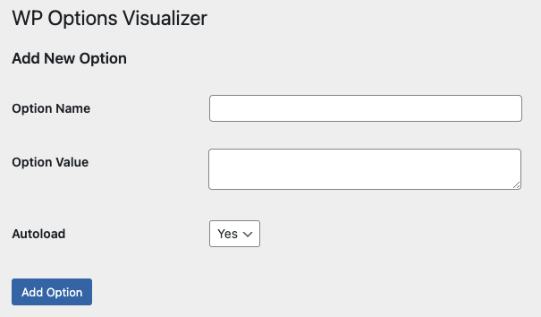
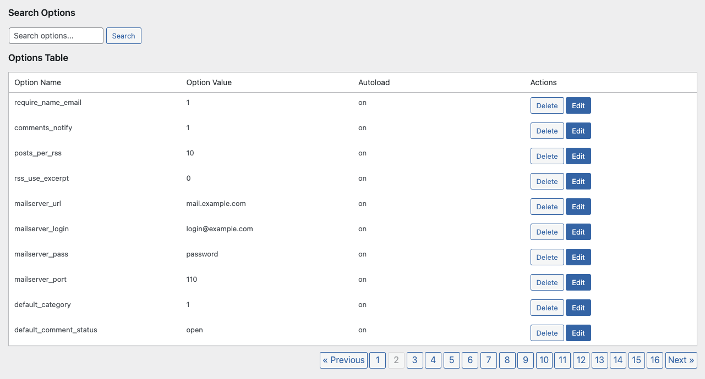

# WP Options Visualizer

**WP Options Visualizer** is a WordPress plugin that allows you to visualize, search, add, edit, and delete options stored in the `wp-options` table directly from the WordPress admin panel.

## Features

- **Visualize Options**: Display all options stored in the `wp-options` table with pagination (10 options per page).
- **Search Functionality**: Search for specific options by their name.
- **Add New Options**: Add new options directly from the admin panel with an option to set the `autoload` property.
- **Edit Options**: Edit existing options, including their value and `autoload` status.
- **Delete Options**: Delete options directly from the admin panel.
- **Security**: Implements WordPress security best practices including sanitization, validation, escaping of input, and nonces.
- **Modular Code**: Follows Object-Oriented Programming (OOP) principles, separating functionality into classes and using an autoloader for better maintainability.
- **Template System**: Uses separate template files for HTML rendering.
- **Localization**: Ready for translation with `.pot` file included.
- **Hooks**: Proper use of activation, deactivation, and uninstall hooks.

## Installation

1. Download the plugin zip file.
2. Upload the zip file through the WordPress admin panel or unzip it to the `wp-content/plugins/` directory.
3. Activate the plugin through the 'Plugins' menu in WordPress.

## Usage

1. Navigate to `Settings > WP Options Visualizer` in the WordPress admin panel.
2. Use the search bar to find specific options.
3. Add new options using the form provided.
4. Edit or delete existing options by using the buttons next to each option.

## Support

For support, you can reach out to the plugin author via the support forums or through the plugin's GitHub repository.

## License

This plugin is licensed under the GPLv2 or later.
